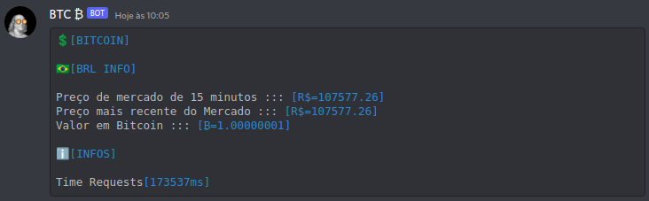

# btc-discord
simple real-time server "bot" to connect bitcoin price using to a webhook.com, from the power to connect your webhook

## Help

for usage, edit file config [src/config.hpp](src/config.hpp) `WEBHOOK_DISCORD` in the webhook part just put your token generated by discord, you can configure the time_out, changing the value of the `TIME_OUT_REQUESTS` macro.

You can change which country you want to view the bitcoin value of a given currency, just change the `BTC_COUNTRY` macro

## Screenshots

